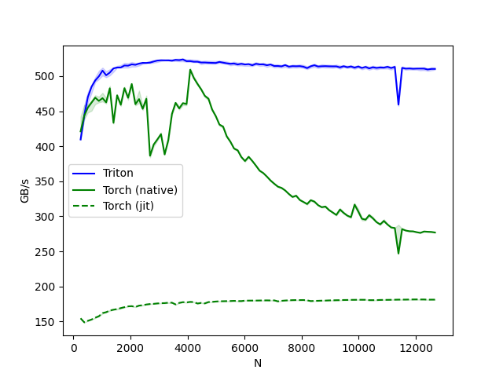

# triton_exp_demo
We provide instructions to run these codes in this section
## Local User
### Dependency Installation
```
conda create -n triton_exp python=3.12
conda activate triton_exp
pip install --editable .
```

### Check Cuda
```
Python check_cuda.py
```

## UCSD Remote User

We will utilzie ucsd dsmlp datahub to build a container to run the program.
More details: [UCSD DSMLP](https://support.ucsd.edu/its?id=kb_article_view&sysparm_article=KB0032269)

### SSH Remote Connection
```
ssh USERNAME@dsmlp-login.ucsd.edu
```

### Build a Container
```
launch-scipy-ml.sh -c 8 -m 32 -g 1 -v 2080ti -i python:latest -s
```
`launch-scipy-ml.sh`: Script to launch a pod
`-c 8`:  8 CPUs
`-m 32`: 32 RAM
`-g 1`: 1 GPU
`-v 2080ti`: 2080ti GPU Version
`-i python:latest`: python:latest docker image
`-s`:  launch only a shell terminal, inhibiting launch of Jupyter

### Installation
```
pip install --editable .
```

## Run Benchmarks of Different tasks
```
Python matrix_multiplication.py or ....
```

## Experiment Results
Experiment Settings: 8 CPUs; 32 RAM; 1 2080ti GPU

### Vector Addition:
```
tensor([1.3713, 1.3076, 0.4940,  ..., 1.1495, 0.9265, 1.1323], device='cuda:0')
tensor([1.3713, 1.3076, 0.4940,  ..., 1.1495, 0.9265, 1.1323], device='cuda:0')
The maximum difference between torch and triton is 0.0
vector-add-performance:
         size      Triton       Torch
0        4096       49152       49152
1        8192       98304       98304
2       16384      196608      196608
3       32768      393216      393216
4       65536      786432      786432
5      131072     1572864     1572864
6      262144     3145728     3145728
7      524288     6291456     6291456
8     1048576    12582912    12582912
9     2097152    25165824    25165824
10    4194304    50331648    50331648
11    8388608   100663296   100663296
12   16777216   201326592   201326592
13   33554432   402653184   402653184
14   67108864   805306368   805306368
15  134217728  1610612736  1610612736
```


### Fused Softamx
```
softmax-performance:
          N      Triton  Torch (native)  Torch (jit)
0     256.0  409.600010      421.114842   154.657229
1     384.0  443.810387      443.560069   148.945450
2     512.0  470.213456      455.111095   151.135193
3     640.0  484.733710      462.172083   152.978524
4     768.0  493.679842      469.231516   155.544308
..      ...         ...             ...          ...
93  12160.0  510.656180      276.480219   181.542808
94  12288.0  510.607957      278.447693   181.540169
95  12416.0  509.374358      278.053236   181.255480
96  12544.0  510.129293      277.818030   181.304419
97  12672.0  510.178193      277.030908   181.311878

```


### Matrix Multiplication
```
triton_output_with_fp16_inputs=tensor([[ 13.3203,  17.2656,  24.0156,  ..., -22.6562,  15.6641,  -5.0430],
        [ -9.3203,  26.3281,  -6.9453,  ...,  31.9375,  23.4062,  18.1094],
        [-11.9609,  44.8750, -22.7812,  ...,  20.9844, -56.5000,  10.3125],
        ...,
        [-11.0703,  -1.9775, -10.2891,  ...,  26.0000, -61.7812, -13.1172],
        [ 23.5938, -21.3281, -34.5938,  ...,  47.5938, -25.0469,  -0.1646],
        [-22.6406,  16.5156,   8.3828,  ...,  30.6250,  31.6719,  16.9688]],
       device='cuda:0', dtype=torch.float16)
torch_output_with_fp16_inputs=tensor([[ 13.3203,  17.2656,  24.0156,  ..., -22.6562,  15.6641,  -5.0430],
        [ -9.3203,  26.3281,  -6.9453,  ...,  31.9375,  23.4062,  18.1094],
        [-11.9609,  44.8750, -22.7812,  ...,  20.9844, -56.5000,  10.3125],
        ...,
        [-11.0703,  -1.9775, -10.2891,  ...,  26.0000, -61.7812, -13.1172],
        [ 23.5938, -21.3281, -34.5938,  ...,  47.5938, -25.0469,  -0.1646],
        [-22.6406,  16.5156,   8.3828,  ...,  30.6250,  31.6719,  16.9688]],
       device='cuda:0', dtype=torch.float16)
❌ Triton and Torch differ
Mismatched elements: 87
Percentage of mismatched elements: 0.03%
Max absolute difference: 0.03125
Max relative difference: 0.1947021484375
Triton mismatched elements: [ -5.58    -19.25     44.2      24.72    -10.75    -12.54    -22.19
   9.484     9.484     9.484   -44.6       3.375    24.69      9.086
  -3.162    42.75     11.06     11.06      4.492     4.496    11.266
  -3.885   -13.81    -37.78    -48.7      17.66    -22.2      -1.37
  18.58     25.6     -21.39    -21.39      3.625    10.11      4.766
  32.66     14.24      8.07     15.695    -0.694   -21.7       4.285
 -11.19     -0.1515   -5.805    -5.047    42.25    -10.97      2.893
   6.4      10.02      1.93    -10.58      8.38    -18.14    -18.14
   2.719   -15.375   -15.375    15.22    -19.52     -3.996    23.86
  15.01    -18.36      0.4517    0.1927   -3.832    14.55     33.62
  -3.943    -8.13     12.75    -21.89     -8.89     35.6       0.05933
   0.2074    3.252     0.2463   28.86     40.88      4.402    16.25
  11.83    -22.66     -5.043  ]
Torch mismatched elements: [ -5.58    -19.25     44.2      24.72    -10.75    -12.54    -22.19
   9.484     9.484     9.484   -44.6       3.375    24.69      9.086
  -3.162    42.75     11.06     11.06      4.492     4.496    11.266
  -3.885   -13.81    -37.78    -48.7      17.66    -22.2      -1.37
  18.58     25.6     -21.39    -21.39      3.625    10.11      4.766
  32.66     14.24      8.07     15.695    -0.694   -21.7       4.285
 -11.19     -0.1514   -5.805    -5.047    42.25    -10.97      2.893
   6.4      10.02      1.93    -10.58      8.38    -18.14    -18.14
   2.719   -15.375   -15.375    15.22    -19.52     -3.996    23.86
  15.01    -18.36      0.4517    0.1927   -3.832    14.55     33.62
  -3.943    -8.13     12.75    -21.89     -8.89     35.6       0.05933
   0.2074    3.252     0.2463   28.86     40.88      4.402    16.25
  11.83    -22.66     -5.043  ]
triton_output_with_fp8_inputs=tensor([[-2.1438e+01,  1.3172e+01,  6.0352e+00,  ..., -1.5570e+01,
          2.0688e+01,  5.1055e+00],
        [ 1.0000e+01,  3.7000e+01, -5.5664e+00,  ...,  1.5010e+00,
          2.7938e+01,  2.2832e+00],
        [ 1.9562e+01, -3.0078e+00, -2.0047e+01,  ...,  3.3936e-02,
         -5.2188e+00,  1.7500e+01],
        ...,
        [-2.6703e+01,  2.8672e+01,  3.4336e+00,  ..., -1.6984e+01,
         -1.1977e+01,  3.5566e+00],
        [-2.5859e+01, -2.5594e+01,  3.0225e-01,  ..., -1.9609e+01,
         -9.2031e+00, -4.9102e+00],
        [ 4.8281e+01,  1.7969e+01,  2.6289e+00,  ..., -1.1602e+01,
         -3.3105e+00,  1.3859e+01]], device='cuda:0', dtype=torch.float16)
torch_output_with_fp8_inputs=tensor([[-2.1438e+01,  1.3172e+01,  6.0352e+00,  ..., -1.5570e+01,
          2.0688e+01,  5.1055e+00],
        [ 1.0000e+01,  3.7000e+01, -5.5664e+00,  ...,  1.5010e+00,
          2.7938e+01,  2.2832e+00],
        [ 1.9562e+01, -3.0078e+00, -2.0047e+01,  ...,  3.3936e-02,
         -5.2188e+00,  1.7500e+01],
        ...,
        [-2.6703e+01,  2.8672e+01,  3.4336e+00,  ..., -1.6984e+01,
         -1.1977e+01,  3.5566e+00],
        [-2.5859e+01, -2.5594e+01,  3.0225e-01,  ..., -1.9609e+01,
         -9.2031e+00, -4.9102e+00],
        [ 4.8281e+01,  1.7969e+01,  2.6289e+00,  ..., -1.1602e+01,
         -3.3105e+00,  1.3859e+01]], device='cuda:0', dtype=torch.float16)
✅ Triton and Torch match
matmul-performance-fp16:
         M       N       K     cuBLAS     Triton
0    256.0   256.0   256.0   4.500326   3.297409
1    384.0   384.0   384.0   9.216000   8.825297
2    512.0   512.0   512.0  18.275834  16.008795
3    640.0   640.0   640.0  25.206154  22.787204
4    768.0   768.0   768.0  27.118344  23.225228
5    896.0   896.0   896.0  37.464745  31.930182
6   1024.0  1024.0  1024.0  49.932191  41.916843
7   1152.0  1152.0  1152.0  34.949336  29.822562
8   1280.0  1280.0  1280.0  43.415701  34.044676
9   1408.0  1408.0  1408.0  52.705991  41.636478
10  1536.0  1536.0  1536.0  47.955203  34.030863
11  1664.0  1664.0  1664.0  50.555685  40.535639
12  1792.0  1792.0  1792.0  52.520673  45.087320
13  1920.0  1920.0  1920.0  50.163635  40.421051
14  2048.0  2048.0  2048.0  57.336561  47.027938
15  2176.0  2176.0  2176.0  44.145934  41.577786
16  2304.0  2304.0  2304.0  49.033767  44.249604
17  2432.0  2432.0  2432.0  53.882102  41.932037
18  2560.0  2560.0  2560.0  58.514284  47.275747
19  2688.0  2688.0  2688.0  49.391998  45.738641
20  2816.0  2816.0  2816.0  53.826011  43.527156
21  2944.0  2944.0  2944.0  56.610746  45.264334
22  3072.0  3072.0  3072.0  50.646783  44.407012
23  3200.0  3200.0  3200.0  53.691275  43.464881
24  3328.0  3328.0  3328.0  56.757284  45.221106
25  3456.0  3456.0  3456.0  52.139010  44.654865
26  3584.0  3584.0  3584.0  55.024099  44.206193
27  3712.0  3712.0  3712.0  51.085324  43.699627
28  3840.0  3840.0  3840.0  53.524666  45.739042
29  3968.0  3968.0  3968.0  51.925080  45.506378
30  4096.0  4096.0  4096.0  54.692406  46.264028
matmul-performance-fp8:
         M       N       K     Triton
0    256.0   256.0   256.0   3.339414
1    384.0   384.0   384.0   8.914217
2    512.0   512.0   512.0  17.189771
3    640.0   640.0   640.0  23.813953
4    768.0   768.0   768.0  26.484146
5    896.0   896.0   896.0  36.610501
6   1024.0  1024.0  1024.0  42.744500
7   1152.0  1152.0  1152.0  40.249154
8   1280.0  1280.0  1280.0  49.293720
9   1408.0  1408.0  1408.0  47.659290
10  1536.0  1536.0  1536.0  45.960314
11  1664.0  1664.0  1664.0  53.564953
12  1792.0  1792.0  1792.0  52.659089
13  1920.0  1920.0  1920.0  51.492027
14  2048.0  2048.0  2048.0  52.354663
15  2176.0  2176.0  2176.0  51.430138
16  2304.0  2304.0  2304.0  52.849273
17  2432.0  2432.0  2432.0  52.611357
18  2560.0  2560.0  2560.0  53.894739
19  2688.0  2688.0  2688.0  53.885772
20  2816.0  2816.0  2816.0  51.936166
21  2944.0  2944.0  2944.0  53.472138
22  3072.0  3072.0  3072.0  53.034960
23  3200.0  3200.0  3200.0  51.785174
24  3328.0  3328.0  3328.0  55.658888
25  3456.0  3456.0  3456.0  53.962436
26  3584.0  3584.0  3584.0  53.679329
27  3712.0  3712.0  3712.0  52.911727
28  3840.0  3840.0  3840.0  52.145287
29  3968.0  3968.0  3968.0  50.990370
30  4096.0  4096.0  4096.0  53.134494
```
!!!: GPU 2080ti architecture causes precision loss from fp32 to fp16 so fp16 torch tensors are mismatched between naive one and triton one.


### Drop Out
```
---------  --------  --------  -------  ---------  ---------  -------  --------  -------  --------  --------
input      0.900982  0.118446  1.24083  -0.272319  -0.748981  2.52844  0.249935  -1.3736  0.882608  -1.34505
keep mask  0         0         0         1          0         1        1          1       1          0
output     0         0         0        -0.544637   0         5.05688  0.499871  -2.7472  1.76522    0
---------  --------  --------  -------  ---------  ---------  -------  --------  -------  --------  --------
-------------------  -------  --------  -------  --------  --------  -------  ---------  --------  ---------  ----------
input                1.26595  -1.08126  1.12767  -1.60594  -1.66709  1.21882  -0.331643  0.570597  -0.777138  -0.0401698
output (seed = 123)  0        -2.16252  0         0         0        2.43765   0         0         -1.55428   -0.0803397
output (seed = 123)  0        -2.16252  0         0         0        2.43765   0         0         -1.55428   -0.0803397
output (seed = 512)  0         0        2.25534  -3.21187   0        2.43765  -0.663287  0          0          0
-------------------  -------  --------  -------  --------  --------  -------  ---------  --------  ---------  ----------
```